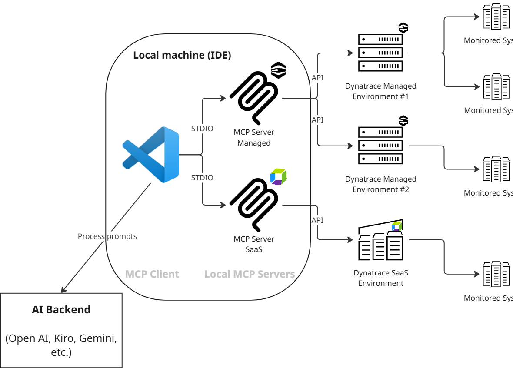
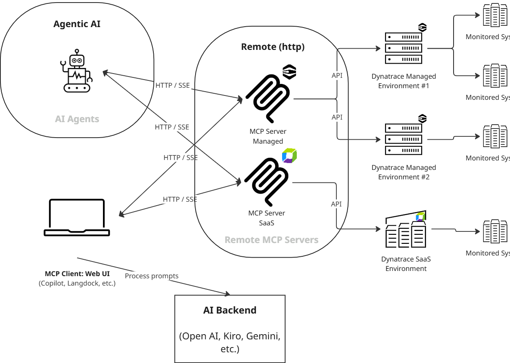

# Overview

## Use cases

There are two ways that Dynatrace Managed, and thus the MCP, may be used:

1. Your Dynatrace Managed environment(s) is/are the primary Observability system, containing all live data; or
2. There has been a migration from a Dynatrace Managed environment to a Dynatrace SaaS environment; however, historical observability data has not been migrated and can still be accessed via a Dynatrace Managed environment.
   The Dynatrace Managed MCP is used to access historical data, and a separate Dynatrace SaaS MCP is used to access live and more recent data — see [Hybrid SaaS + Managed setup](hybrid-saas-managed.md) for running both together.

Specific use cases for the Dynatrace Managed MCP include:

- **Real-time observability** - Fetch production-level data for early detection and proactive monitoring
- **Contextual debugging** - Fix issues with full context from monitored exceptions, logs, and anomalies
- **Security insights** - Get detailed vulnerability analysis and security problem tracking. This can include multicloud compliance assessment with evidence-based investigation.
- **Natural language queries** - Queries are mapped to MCP tool usage, and thus API queries, with guidance for the next step
- **Multiphase incident investigation** - Systematic impact assessment and troubleshooting
- **Multienvironment support** - Query multiple Dynatrace Managed environments from the same MCP server

## Capabilities

- **Problems** - List and get [problem](https://www.dynatrace.com/hub/detail/problems/) details from your services (for example Kubernetes)
- **Security** - List and get security problems / [vulnerability](https://www.dynatrace.com/hub/detail/vulnerabilities/) details
- **Entities** - Get more information about a monitored entity, including relationship mappings
- **SLO** - List and get Service Level Objective details, including evaluation and error budgets
- **Event Tracking** - List and get system events
- **Log Investigation** - Search and filter logs with advanced content and time-based queries
- **Metrics Analysis** - Query and analyze performance metrics using V2 Metrics API

These capabilities are all implemented on top of Dynatrace Managed's V2 REST APIs. Per standard Dynatrace Managed licensing, calls to these APIs incur no additional cost beyond your existing Managed license.

## Architecture

### Local mode

See [Set up local (stdio) mode](setup-local.md) to configure and run the server this way.

### Remote mode

See [Set up remote (HTTP) mode](setup-remote.md) to configure and run the server this way.

## Performance considerations

**Important:** This MCP server makes API calls to the Dynatrace Managed environment(s). It is designed for efficient usage (e.g., limiting the response sizes), but care should be taken not to overload the Dynatrace Managed environment(s) with large queries.

**Best Practices:**

1. Use specific time ranges (e.g., 1-2 hours) rather than large historical queries.
2. Use specific filters to limit the scope of queries as much as possible, for example, entity selectors that specify the entity ID.
3. If using multiple environments, be specific about which one to query, where applicable. If querying multiple at once, be mindful of how much data will be returned to the LLM, e.g. top 10 problems from 2 envs = 20 problems, versus top 10 problems from 10 envs = 100 problems.

## How this differs from the SaaS MCP

This MCP is for Dynatrace Managed platforms. There is a different [Dynatrace MCP](https://github.com/dynatrace-oss/dynatrace-mcp) server for use with Dynatrace SaaS.

Key differences include:

- Dynatrace SaaS MCP uses DQL, whereas Dynatrace Managed uses the v2 APIs
- Dynatrace SaaS MCP uses Davis CoPilot, whereas Dynatrace Managed does not
- Dynatrace SaaS MCP uses OAuth, whereas Dynatrace Managed uses API Tokens

Running both servers together, including in the historical-data migration scenario above: [Hybrid SaaS + Managed setup](hybrid-saas-managed.md).
